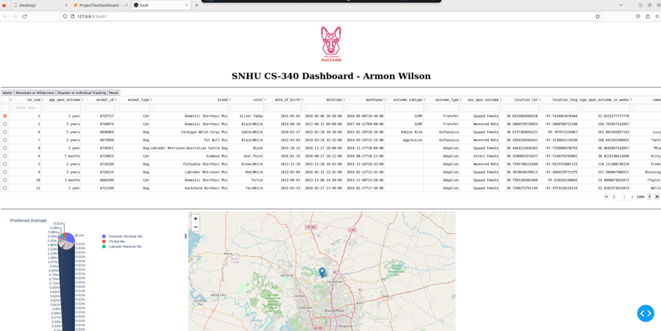
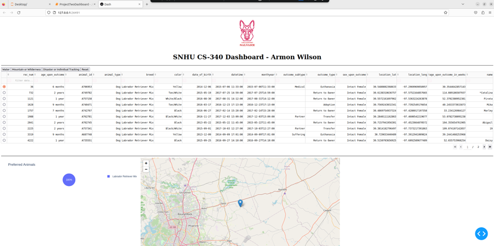
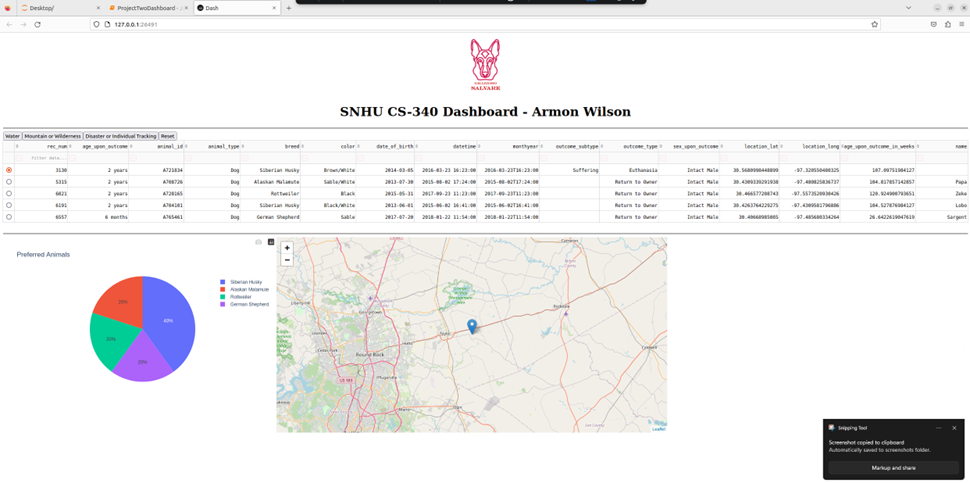
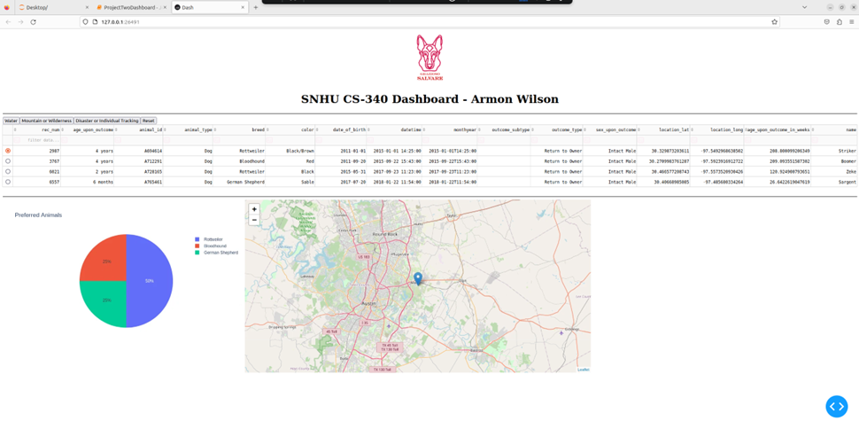
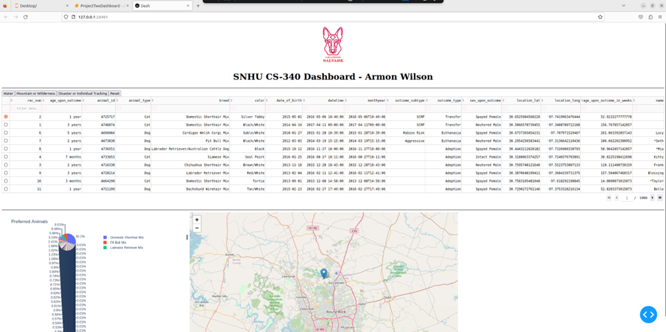

# SNHU CS-340 Dashboard - Armon Wilson

## Project Overview

This dashboard provides an interactive visualization of animal shelter data, allowing users to explore and analyze information about animals available for adoption. It was created as part of the CS-340 course at Southern New Hampshire University.

## Functionality

The dashboard offers the following features:

- **Interactive Data Table:** Displays detailed information about each animal, including breed, age, sex, and outcome. Users can sort, filter, and select rows to explore the data.
- **Pie Chart:** Visualizes the distribution of animals by breed, providing insights into the most common types of animals in the shelter.
- **Geolocation Map:** Shows the location of each animal on a map. Users can select a row in the data table to highlight the corresponding animal's location on the map.
- **Filtering:** Users can filter the data using buttons to focus on specific rescue type needed (e.g., water rescue, those suitable for mountain or wilderness rescue, or those trained for disaster or individual tracking).

## Tools and Technologies

The following tools and technologies were used to build this dashboard:

- **Dash:** A Python framework for building web applications. Dash was chosen for its ease of use, ability to create interactive components, and integration with Plotly for visualizations.
- **Plotly Express:** A library for creating interactive charts. Plotly Express was used to generate the pie chart, providing a visually appealing and informative representation of the data.
- **dash-leaflet:** A Dash component library for integrating Leaflet maps. dash-leaflet was used to create the geolocation map, allowing users to visualize the location of each animal.
- **MongoDB:** A NoSQL document database. MongoDB was chosen as the data store due to its flexible schema, which is well-suited for handling diverse data. It also offers good performance and scalability.
- **Python:** The programming language used for data retrieval, manipulation, and application logic.

## Resources and Links

- **Dash Documentation:**
  https://dash.plotly.com/
- **Plotly Express Documentation:**
  https://plotly.com/python/plotly-express/
- **dash-leaflet Documentation:**
  https://dash-leaflet.herokuapp.com/
- **MongoDB Documentation:**
  https://www.mongodb.com/docs/

## Project Steps

1. **Data Retrieval:** Connected to the MongoDB database using the provided credentials and the `AnimalShelter` class from the `AAC_Crud` module.
2. **Data Processing:** Cleaned the data by removing the `_id` column to ensure compatibility with the DataTable component.
3. **Layout Design:** Created the dashboard layout using Dash HTML components, including the header, data table, filter buttons, pie chart, and map.
4. **Callback Implementation:** Wrote callback functions to handle user interactions, filter data, update the pie chart, and display animal locations on the map.
5. **Testing and Deployment:** Tested the dashboard thoroughly to ensure all components functioned as expected. Deployed the dashboard using `app.run_server(debug=True)`.

## Challenges and Solutions

- **Challenge:** The initial pie chart did not display correctly due to an issue with the data structure.
  - **Solution:** Added a check to handle empty `viewData` and an empty DataFrame in the `update_graphs` callback, which resolved the issue.
- **Challenge:** Ensuring the map displayed the correct location for the selected animal.
  - **Solution:** Implemented error handling in the `update_map` callback to catch potential issues with missing or invalid coordinates and provide a fallback location.

## Screenshots

## Assignment 8-2 Journal Rubric:
**Maintainability, Readability, and Adaptability**

The project emphasized the importance of writing clean, well-documented, and modular code. The CRUD Python module developed in Project One played a crucial role in achieving
these goals. By encapsulating database operations within this module, the dashboard code became more maintainable, readable, and adaptable. This modular approach also
promotes reusability, allowing the CRUD module to be easily integrated into future projects involving MongoDB.

**Approaching Problems as a Computer Scientist**

This project required a systematic and analytical approach, starting with understanding the client's needs and then designing and implementing a solution that met those needs.
The process involved database design, data visualization, and user interface development, providing a more holistic and real-world experience compared to previous assignments.
For future database projects, techniques like data modeling, normalization, query optimization, and security considerations will be essential.

**The Impact of Computer Science**

Computer scientists play a crucial role in solving real-world problems through technology. The Grazioso Salvare dashboard demonstrates how computer science can empower
organizations to improve their data management, analysis, and decision-making. By providing tools for efficient data visualization and analysis, this project can help the shelter
to better understand their operations, optimize resource allocation, and ultimately improve the lives of animals in their care.
